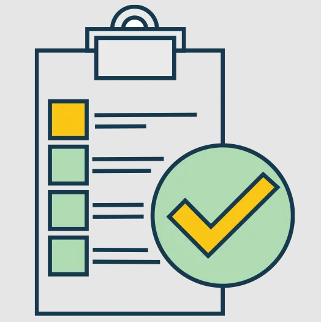
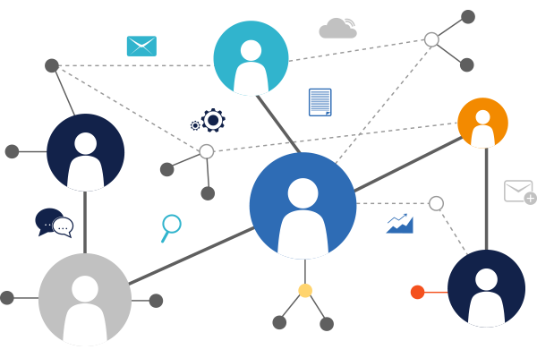

## A Journey called Software Engineering

In my third year of university life at UH Manoa, I went on a trip called software engineering. During the journey, there were some obstacles and problems. However, without any exaggeration, the journey was the most impressive and practical time that I ever experienced in my life. From the journey, I could learn not only just new programming languages, JavaScript, HTML, and CSS, but also, I could learn the fundamental concepts and skills that I can use in the future when I face the real-world problems, such as development environments, functional programming, design patterns, etc. Among those, I would like to discuss few things that are landmarks that I love. 

## Coding Standards

The first landmark that I would like to introduce is a “Coding Standards”. The coding standards are the “Uniform” for the codes among the shared group of people. By sharing the uniform, the codes look more consistently and easy to understand them when other members of the group take a look at.  Before I learned about the coding standards, every time when I write a code, it looks so different although the content is the same. Also, whenever I look at someone else’s codes, I really had a hard time to understand it because of the different appearances. However, after I implement the coding standard, ESLint in my journey, the codes became clearer. Also, during the team project, sharing the same coding standards has a huge advantage because it improves the quality of communication between the team members. So, learning about the coding standard was very impressive and helpful to me. Furthermore, it would be a very practical skill that I can even use when I get on another journey in the future. 

## Agile Project Management

Another landmark that I love is an “Agile Project Management”. It is a system of development management that shared among a group of developers so that they can drive the project smoothly. During the journey, I had a project, Roomniverse, which web development project that UH students can find their roommates and upload some posts. During the project, I could learn and use one types of the Agile Project Managements, Issue Driven Management. The Issue Driven Management is a method of dividing problems into very smaller pieces, and each team member are handles one issue at a time. So, at the end, the issues are combined to complete the tasks. Before I learned this, I managed several problems at once, and it was very messy when I work on my project. However, this method of management makes the project much clear and more handleable. I believe that when I work as a team, this must be a fundamental skill in the future.

## Regroup for another journey

This journey took a lot of efforts and time, but the landmarks were very helpful and impressive. I really enjoyed the things that I learned from this journey of software engineering. I believe that I can use them in the future when I face the real-world problems. Now, it’s a time to take a rest and regroup for the next journey. I hope that there will be more interesting landmarks in my future journeys. 
