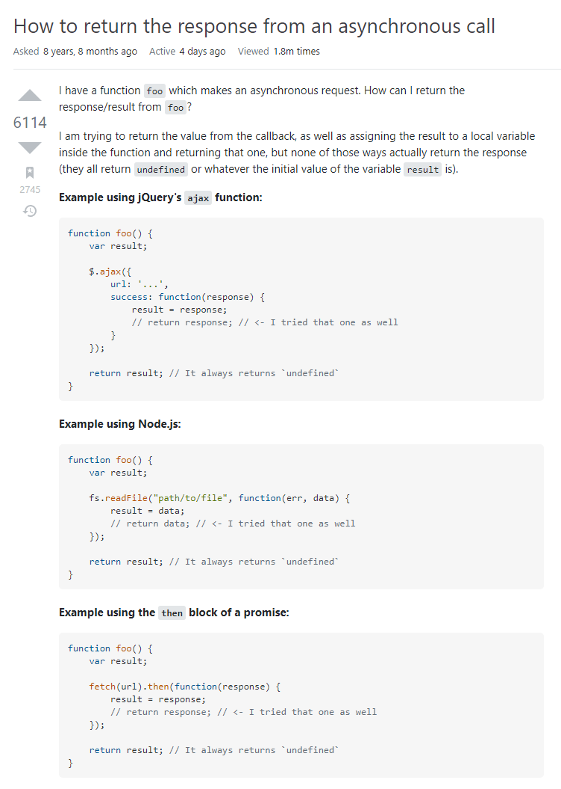
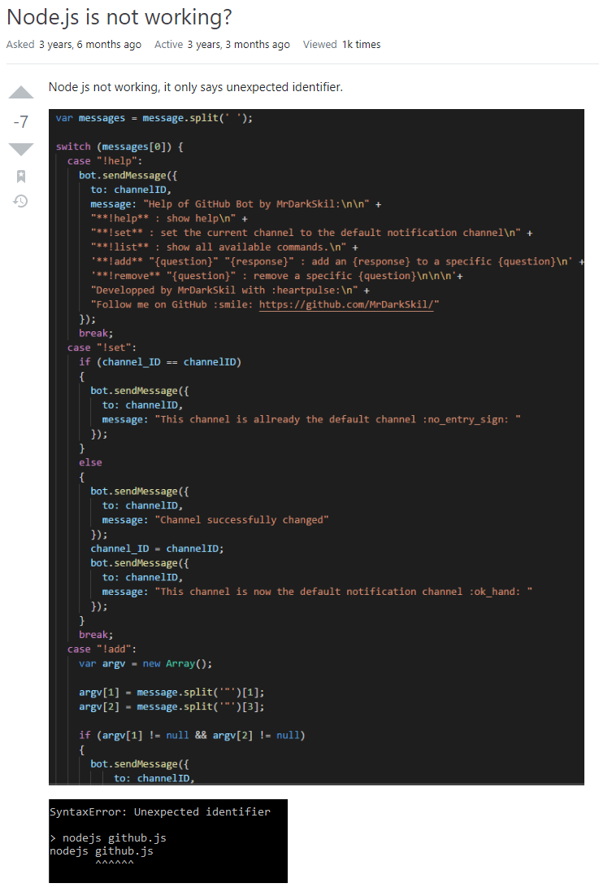

## Smart Question to Get Help

When people get stuck on their problems, it is common to ask for help. One way to ask for help is post the questions on the internet website to ask questions to people all around the world. Especially, in computer science, it happens very frequently. One example of the website is Stack Overflow, which is very well-known and popular website for developers all around the world, and they ask and answer various questions about computer science. However, not all the questions receive the expected response. It’s not because the problems are too hard and difficult so no one can answer them. However, it’s because the way that people ask the question are wrong. In other words, people who ask a “Bad Question”  do not likely get the good response. So, it is important to ask in a “Smart Way.” In a article How To Ask Questions The Smart Way by Eric Steven Raymond gives very well organized guideline for asking smart. 

## Smart Question

From Stack Overflow, [one example of smart question](https://stackoverflow.com/questions/14220321/how-to-return-the-response-from-an-asynchronous-call) is shown above. The person asks a question about returning response from an asynchronous function call. He or she clearly states what is the problem and what he wants to get. He even provides a simple example code so that people can easily understand and solve the question with the sample. As the result, the question received a lot of up-votes, which indicates for useful question, and people posted very well-explained answers as well. 

## Non-Smart, or Bad, Question

On the other hand, the second image shows the [non-smart question, or bad question](https://stackoverflow.com/questions/49214481/node-js-is-not-working). This person asks about his or her code that is not working as expected with the images of the code. However, those are the everything that the person posted. He or she does not give any hints or explanation about the code. Also, he or she puts his or her code with image files (not even a copy-paste). As the result, of course, the post does not receive appropriate answers.

## Cornerstone of Successful Communication

Like the examples, asking the smart question is very important for software engineers. It’s not only to get appropriate help and solve problems, but also because it is directly related to communication skills. When developers do teamwork, they do not show independent work and combine them. They make a lot of communication verbally or in writing. So, it is very significant to ask questions in a smart way for software engineers so that improve their communication skill. 
