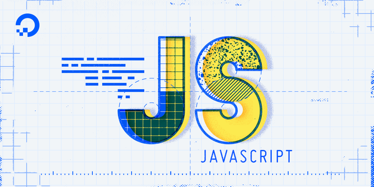

## My First Glance of JavaScript

I started to learn the coding in my junior at high school. Ever since then, I used various kinds of programming language, such as Java, Python, C, and C++. Definitely, I knew that there is a programming language called “JavaScript”. However, I didn’t get any interest of it until I actually used it about a week ago because for me, it sounded like a downgraded version of Java and it’s the language that only use for designing websites. However, after I learn about it, I can tell that the JavaScript has its own characteristics and advantages that other programming languages I used before don’t have. 

## Meet a Nice Friend

JavaScript is very coder-friendly language, and it’s not restricted like other languages. JavaScript makes the coders to think less and solve problems much easier. For example, in Java or C, when we implement a function from some other library or class, we need to take care about a lot of things. However, in JavaScript, it can be done in just one or two steps. Also, another amazing feature of JavaScript is that it does not care about the function or array type. In other languages, only one type of value can be stored in array or returned from a function. However, JavaScript just does not care about it. Sometimes it returns integer, sometimes string, and even sometimes another function in just one function! As I learn a new friend called “JavaScript”, I’m so fascinated about it and excited the things that I will make with this great friend.

## Stressful? Enjoyable!

When I first heard about WODs, I was so nervous about it because it feels like I’m pressed by time and do not solve the problem with the stresses. However, in fact, they are pretty much enjoyable. When I did the practice WODs, it feels like I’m testing my skills and knowledge by solving the quizzes, rather than solving a hard, complex problems. Also, in fact, the time limit is really the Maginot Line that prevents random trials. Moreover, although I get correct answer to solve the problem, I can watch the solution video and learn more efficient way to solve it. So, I really like the practice WODs and from that I can grow my problem solving skills while preparing not only the actual WODs, but also the problems that I will encounter in the future. 
