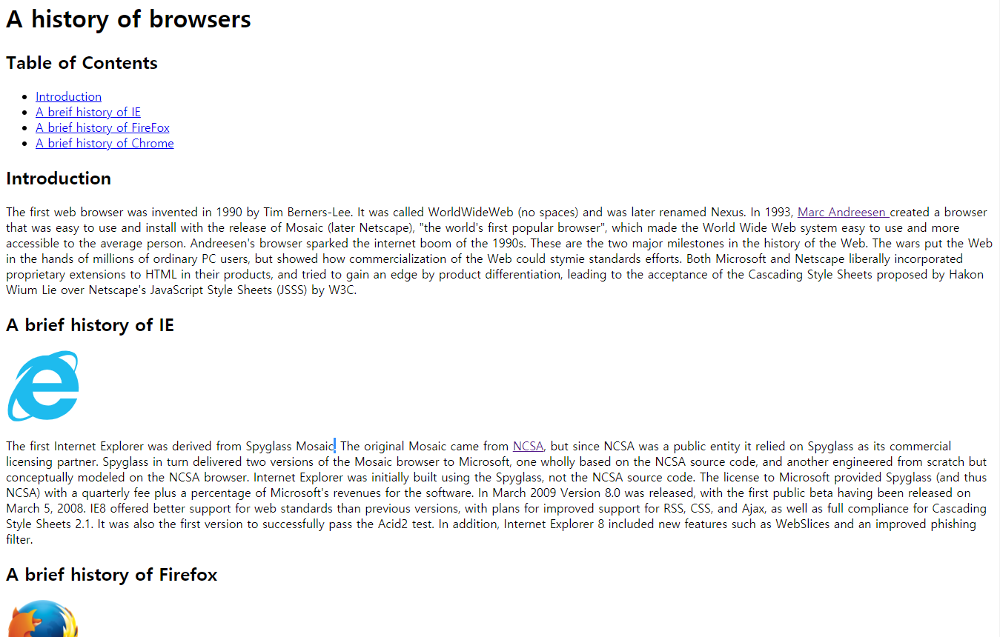
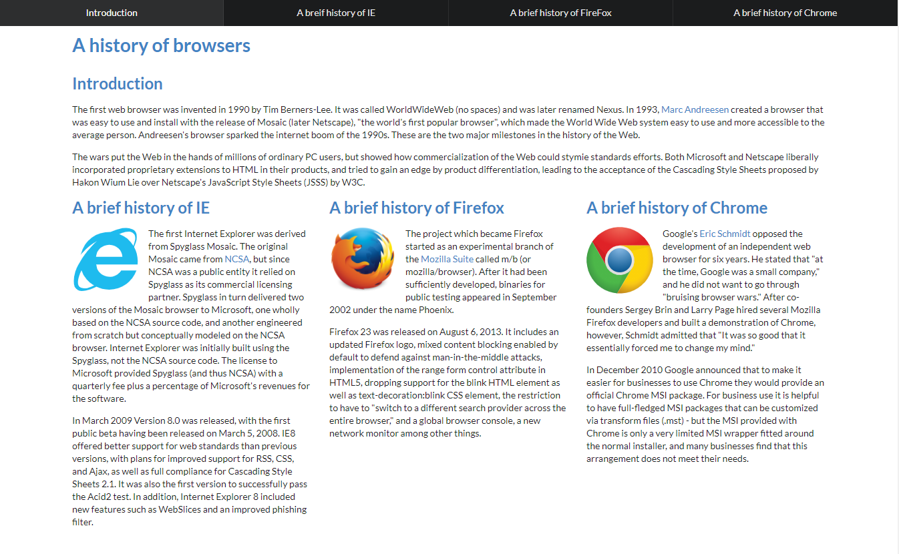

## What looks good, Tastes good

In computer science, algorithms and performances are regarded as the best and most important qualities. Of course, they are important because if the program does not work as expected, it’s just a useless things. However, at the same time, the UI, abbreviation of user interface, is also important as algorithms, especially for web design parts. We often say, “What looks good, tastes good.”. It’s also used in web designs. When people visit a website, if the website is messy and ugly, they would not visit and buy products again. However, if the website is attractive and well-designed, people would visit it again. Like this, having an attractive UI is one of the important factors that make a better result.

## Why UI Framework?

To use UI Framework, we need to study about different features and rules. Also, they are not a simple. Then, why we use UI Framework and not raw HTML and CSS? One of the reasons is that once we get familiar with UI Framework, it reduces a significant amount of time to make a good enough web design. In raw HTML and CSS files, it needs several lines of codes to make a menu while in Semantic UI, it provides a simple class that defines certain division as a menu like ‘
’. Moreover, in Semantic UI, it provides a lot of useful icons that make the website more attractive. 

## Another level up with Semantic UI 

After a one week of experience with Semantic UI, I feel more confident with designing a website. I’m not an artistic person and really bad at designing things. However, with the Semantic UI, I could make a good enough web page. 

  
The first picture is screenshot from my web project without using Semantic UI and the second one is with the Semantic UI. As we can see, although the contents are the same, the website with Semantic UI can make more attractive web page. Of course, it’s just a very basic step of UI Framework. However, with such UI Framework, I will be able to do more and more functions, and it is definitely a worth investment to improve my quality of web design.
