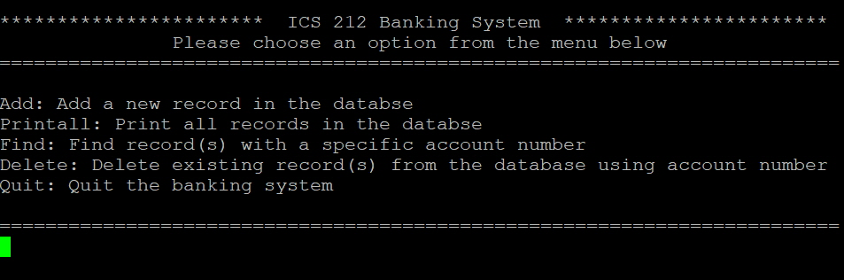

The Banking System is a project that I made in ICS 212 at University of Hawaii in Manoa in 2020 Fall semester. It has five different functions: add, printall, find, delete, and quit. First of all, add is literally add the information about the user, such as name, address, and account number. And printall prints all the information that is stored in the system, and user can find their information by put account number in find function. Also, user can delete their information using delete function. Moreover, before the system is closed, it stores every information in the system and make a record so that it keeps the information. 

In the mid-semester, it is first designed and developed using C language. Then, at the end of semester, the last project was to convert the banking system that is written in C to C++. By doing this project, I could learn about the differences and similarities between C and C++. Also, the project is written in Unix system, so I could learn some features of Unix. Furthermore, the debugging and testing the code is also a part of the project. So, I could learn how the testing is made and designed. 

Source code is available at: <a href="https://github.com/jubinc0911/banking_system"><i class="large github icon "></i>jubinc0911/banking_system</a>

