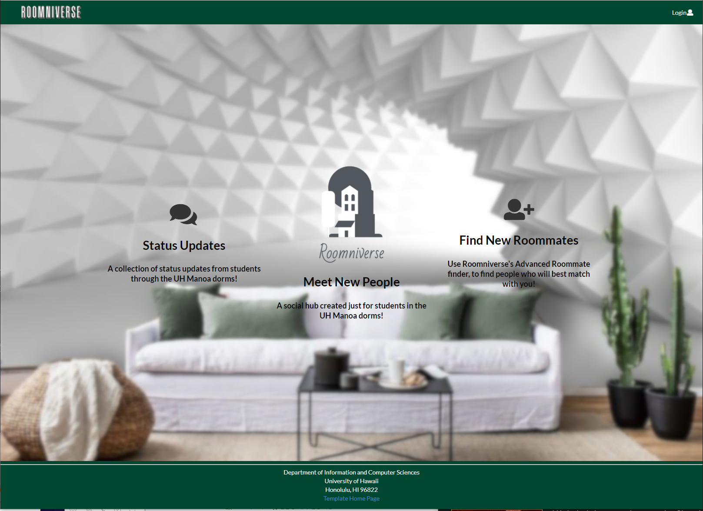
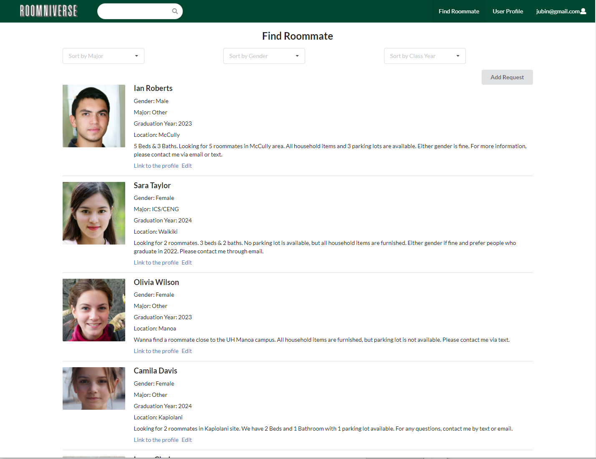
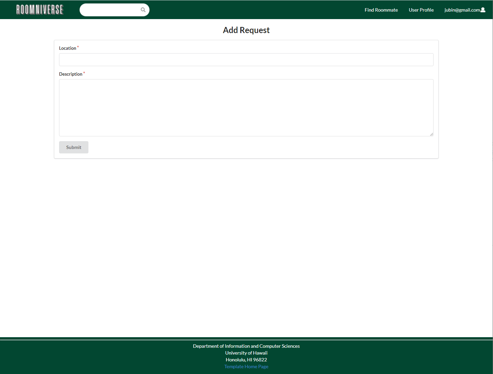

## Overview

The Roomniverse is a web application that developed in Fall 2021 semester in ICS 314, software engineering course. It provides UH students to find their roommates and posts their messages in the hub. By signing up the application, students can create their profile with avatar, and post a roommate find requests with location and description. Users can filter the requests by selecting the dropdown menu, and they also can search users by the search bar at the top navigation bar. Moreover, users can upload their posts into the main hub so that they can communicate with other users in the hub.

## What I contributed to Roomniverse

The Roomniverse is a team project with five group members: Ju-Bin Choi(me), HyunJun Song, Scott Vore, Tracy Bui, and Jonathan Valencia. I was mainly responsible for the Find Roommate page which lists up the users’ requests when they create the requests. I created the lists of requests using open-source programs such as MongoDB, Semantic UI React, Meteor, etc. Also, I created the Add Request and Edit Request pages so that each user can manage his or her request easily. In the Add Request and Edit Request pages, the system automatically brings up the current user’s information, and thus, the user doesn’t need to provide every single information when he or she create the request. 

In addition to the Find Roommate and Requests, I also focused on creating a “realistic” default Request data. The data in the application is not the “real” data, but I implemented “realistic” default Request data so that how the application look like when twentieth of people use the web. 

## What I learned from Roomniverse

This Roomniverse project was the biggest project that I have ever done in my life. Before this, all the projects were just created by myself or me and with one more classmate. So, I could learn how to manage the projects when there are more than two. More specifically, the Issue Driven Project Management was crucial in the project. It really helped me to manage how team members can split the tasks. 

In addition to that, this was my first project that used Git and GitHub. So, I could learn how to use GitHub as configuration management, such as resolving conflicts and setting a back-up. It must be very useful skill when I work on another project in the future. Also, the project used a lot of other open-source programs. Thus, I could learn how to create a project with appropriate programs as well. 

You can find more information from [Roomniverse's page](https://roomniverse.github.io/)

Source code is available at: <a href="https://github.com/roomniverse/roomniverse-webapp"><i class="large github icon "></i>roomniverse/roomniverse-webapp</a>

