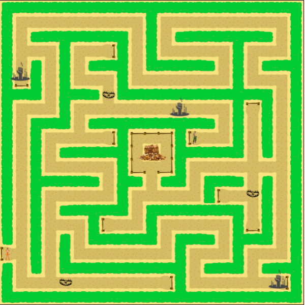

## Description

The Trap Maze is the game that my partner and I created for the final project at Kalani high school computer science course in 2018. For the final project, each student made teams, and they design and develop a game. For my team, we created a Trap Maze, which the user controls a man by using arrow keys in the keyboard to get a treasure in the middle of the maze. Also, when the player hits the traps, certain actions are happened. At the same time, the player needs to find hunter who owns a key to open the treasure box. So, to open the box and win the game, the player needs to bring the hunter as well. In the maze, the wall is made of spikes, so when the player hits the wall, the game is over. 

## Gains from the project

It was my first group project that I did my work as a team. Before that I only worked by myself without separate my work to someone else. In the project, though we helped each other, my partner usually designed the game and found resources, and I usually took part by writing code. Although I separated my work with team member, I feel more pressure at the same time. So, I could learn how should I engage the project as a member of a team. Moreover, I could gain an experience about how to develop and design a program from the start to the end. 

Source code is available at: <a href="https://github.com/jubinc0911/Kalani-HS-projects/tree/main/Trap%20Maze"><i class="large github icon "></i>jubinc0911/Kalani-HS-projects/tree/main/Trap%20Maze</a>

